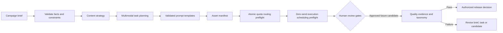

# AIGC Content Production Studio

[](https://github.com/magicyao2028-pixel/aigc-content-production-studio/actions/workflows/ci.yml)
[](LICENSE)

> 中文介绍：这是一个面向中小企业内容团队的AIGC多模态生产流程原型。它把产品事实、受众、目标、品牌语气和合规限制整理成视频、生图、语音任务包、资产清单与人工审核闸门，并用离线合成审核记录演示事实漂移、主体不稳定、文字不可读、时长不符、权利风险和供应商拒绝六类失败。公开版本还能对已准备但未发送的请求做严格、零发送的幂等与并发波次预检；它不调用付费模型，不把合成记录冒充真实生成质量，也不包含任何公司隐私数据。

**Live prototype:** https://magicyao2028-pixel.github.io/aigc-content-production-studio/

## Project context

This portfolio edition documents an AI application and AIGC product practice explored in the business context of **Changsha Shiju Trading Co., Ltd.** It converts a content request into a traceable production package. The public repository uses a synthetic tea-product brief and makes no claim of real campaign performance.

## Business problem

Small content teams often move directly from a chat message to image, video and voice tools. Facts are lost, prompts become inconsistent, assets are difficult to track, and compliance review happens too late. This prototype demonstrates one controlled workflow that:

- validates the business brief before generation work begins;
- separates approved facts from prohibited claims;
- creates linked video, cover-image and voiceover tasks;
- renders those tasks from a validated, configurable prompt-template set;
- prepares provider request envelopes through an adapter interface without sending them;
- attaches stable asset IDs and expected evidence;
- enforces explicit asset status transitions and preserves a local event history;
- evaluates a manually labelled offline fixture against a six-category failure taxonomy;
- applies an atomic request-quota and abstract cost-unit routing preflight before provider envelopes are prepared;
- applies a strict zero-send execution preflight to eligible `prepared_not_sent` envelopes, producing deterministic job/idempotency identifiers and bounded concurrency waves;
- blocks duplicate request fingerprints atomically before creating any job descriptor;
- requires factual, brand, rights, privacy and release review;
- works offline without calling a paid model API.
- compares reviewed routing policies offline before any provider envelope is prepared.
- compares versioned provider-capability profiles offline and flags breaking changes before future request planning.

## What this repository demonstrates

| Capability | Evidence |
| --- | --- |
| AI product design | [PRD](docs/PRD.md), users, requirements, boundaries and roadmap |
| Agent-style orchestration | Brief validation → strategy → multimodal tasks → manifest → review gates |
| AIGC workflow design | Provider-neutral video, image and voice production instructions |
| Business governance | Approved facts, prohibited claims, responsible owners and final approval |
| Technical implementation | Typed Python domain model, CLI, deterministic package and automated tests |
| Product experience | Zero-cost [browser prototype](site/) showing the full planning flow |
| Asset governance | Validated status machine, append-only local event history and reproducible example ledger |
| Provider portability | Validated prompt templates and an offline adapter contract separated from the core workflow |
| Quality governance | Controlled failure taxonomy, retained evidence and release-blocking decisions on synthetic review cases |
| Execution-boundary proof | Strict scheduling policy, deterministic idempotency keys, bounded waves and duplicate-request atomic blocking with zero attempts or sends |

## Core workflow



The current workflow is deterministic. It does not call an LLM, image model, video model or speech model, so it must not be represented as a production content Agent. v1.1 can prepare provider-shaped request envelopes, build review-only job descriptors and concurrency waves, and evaluate synthetic review labels. It creates no background job, executes no retry or external request, sends nothing to a provider and inspects no real media.

## Quick start

Requirements: Python 3.10 or later. No third-party runtime dependency is required.

```bash
python -m pip install -e .
aigc-studio data/sample_brief.json --templates data/prompt_templates.json --output output/production_package.json
aigc-provider-plan output/production_package.json data/offline_provider_profile.json output/provider_requests.json
aigc-assets initialize output/production_package.json output/asset_history.json
aigc-assets transition output/asset_history.json CMP-TEA-001-01-SHORT_VIDEO generated_candidate --actor content-operator --note "Candidate file recorded"
aigc-quality output/production_package.json data/failure_taxonomy.json data/quality_fixture.json output/quality_report.json
aigc-route output/production_package.json data/offline_provider_profile.json data/routing_policy.json output/routing_plan.json
aigc-execution-preflight output/routing_plan.json data/execution_policy.json output/execution_preflight.json
aigc-studio-trial
python -m unittest discover -s tests -v
```

To run without installation:

```bash
PYTHONPATH=src python -m aigc_content_studio.cli data/sample_brief.json
```

To view the static prototype locally:

```bash
python -m http.server 8000 --directory site
```

Then visit `http://localhost:8000`.

## Public output

[`examples/sample_production_package.json`](examples/sample_production_package.json) contains the deterministic package generated from the synthetic brief. It includes:

- content strategy and a clearly labelled hypothesis;
- a 15-second short-video script, shot plan and generation instruction;
- a cover-image instruction;
- a voiceover script and direction;
- an asset manifest;
- five mandatory human review gates;
- an execution trace and honest implementation limitations.

[`examples/sample_asset_history.json`](examples/sample_asset_history.json) demonstrates local status evidence. The allowed path is `planned → generated_candidate → in_review → approved_final`, with a `changes_requested → generated_candidate` revision loop and optional final archival. Direct approval from `planned` is rejected.

[`examples/sample_provider_requests.json`](examples/sample_provider_requests.json) shows three capability-checked request envelopes. They contain prompts and generation parameters, but every request records `external_call_executed: false`, and the plan records `external_calls_executed: 0`.

[`examples/sample_quality_report.json`](examples/sample_quality_report.json) evaluates seven manually labelled synthetic review cases. Six cases each exercise one controlled failure category and are blocked; one record has no labelled failure and is marked `pass_fixture_only`. This proves taxonomy and release-gate behavior, not generated-media quality.

[`examples/sample_routing_plan.json`](examples/sample_routing_plan.json) applies a reviewed three-request limit and eight abstract cost units to the sample package. The units are deliberately not currency, tokens, provider pricing or a quote. Exceeding either limit blocks atomically and emits no provider envelopes.

[`examples/sample_execution_preflight.json`](examples/sample_execution_preflight.json) validates that eligible routing plan against a strict two-concurrency, three-attempt policy and produces deterministic request fingerprints, idempotency keys, job descriptors and two scheduling waves. Every attempt/request/send counter is zero. A duplicated fingerprint blocks the whole preflight and produces no job descriptor or wave.

[`data/provider_profile_versions.json`](data/provider_profile_versions.json) is a synthetic baseline/candidate fixture. `aigc-provider-diff` reports removed capabilities and requires human review; it does not query a live provider or authorize execution.

## Failure taxonomy

| Category | What it catches | Release owner |
| --- | --- | --- |
| `factual_drift` | Candidate contradicts or invents an approved product fact | Product / Operations |
| `identity_instability` | Product, package, character or brand identity changes unintentionally | Content Lead |
| `unreadable_text` | Required copy is illegible at the target size | Content Lead |
| `timing_mismatch` | Duration or synchronization differs from the approved plan | Content Producer |
| `rights_risk` | Likeness, voice, trademark, copyright or privacy permission is missing | Business Owner |
| `provider_rejection` | Provider capability, policy, format or parameter rejects the request | AI Application Operator |

## Template and model boundary

The tasks are provider-neutral. Template files may change wording and structure only through an allowlisted set of business fields. Provider profiles declare supported task types, ratios and duration limits; they cannot contain unknown fields such as embedded API keys or enable execution. The execution policy accepts only bounded integer concurrency/attempt values and a complete, non-decreasing retry-backoff schedule, but it does not run timers or retries. A future production adapter may route approved tasks to models, but this repository does not claim current access, model performance, provider idempotency or commercial rights. Availability, pricing, regional access and terms must be checked at execution time.

## Honest boundaries

- No media asset is generated or inspected in v1.1.
- No model API, paid service or cloud compute is used.
- No live job queue, worker, retry, external request or provider send is created; job IDs and waves are deterministic review artifacts only.
- Local fingerprint/idempotency keys do not prove that any provider accepts or enforces them.
- Routing cost units are synthetic planning weights, not current provider prices or budget approval.
- Prompts are deterministic planning artifacts, not proof of output quality.
- Synthetic review labels prove only evaluator behavior; `pass_fixture_only` is not media approval.
- Local JSON history is single-user evidence, not durable multi-user persistence, authentication or an approval system.
- The synthetic brief is not a real client case.
- Human review is required before any external generation, publishing or commercial claim.

## Documentation

- [Product requirements](docs/PRD.md)
- [Business workflow](docs/BUSINESS_FLOW.md)
- [System architecture](docs/ARCHITECTURE.md)
- [Model-routing boundary](docs/MODEL_ROUTING.md)
- [Templates and adapter contract](docs/TEMPLATES_AND_ADAPTERS.md)
- [Evaluation plan](docs/EVALUATION.md)
- [Offline quality evaluation](docs/QUALITY_EVALUATION.md)
- [Security and governance](docs/SECURITY.md)
- [Maintenance plan](docs/MAINTENANCE_PLAN.md)
- [Current handoff](HANDOFF.md)
- [Changelog](CHANGELOG.md)
- [Reviewer trial guide](docs/TRIAL_GUIDE.md)
- [Machine-readable evidence index](evidence/evidence_index.json)
- [External component screening](evidence/external_intake.json)
- [Synthetic feedback case](evidence/feedback_case.json)

## Roadmap

- v0.1: validated brief, multimodal task package, asset IDs, review gates, tests and static demo;
- v0.2: asset status transitions and local version history;
- v0.3: configurable prompt templates and non-sending provider adapters;
- v0.4: offline quality fixture and six-category failure taxonomy;
- v0.5: cost-unit, quota and provider-routing preflight plus reviewer trial evidence;
- v0.6: offline comparison of reviewed routing-policy variants with zero-send guarantees;
- v0.7: versioned provider-capability diff with breaking-change detection before request planning;
- v0.8: deterministic human-review decision export with no execution authority;
- v0.9: append-only synthetic decision-review history;
- v1.0: accepted reviewer-feedback replay and stale-feedback visibility;
- v1.1: strict zero-send execution-scheduling preflight with duplicate atomic blocking (current);
- future private pilot: authenticated execution service, durable queue, provider-enforced idempotency, approved assets and measured workflow outcomes.

## License

MIT License. See [LICENSE](LICENSE).
