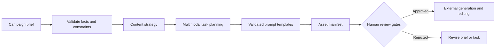

# AIGC Content Production Studio

[](https://github.com/magicyao2028-pixel/aigc-content-production-studio/actions/workflows/ci.yml)
[](LICENSE)

> 中文介绍：这是一个面向中小企业内容团队的AIGC多模态生产流程原型。它把产品事实、受众、目标、品牌语气和合规限制整理成视频、生图、语音任务包、资产清单与人工审核闸门。公开版本只生成制作计划和提示词，不调用付费模型、不声称已经生成或发布真实内容，也不包含任何公司隐私数据。

**Live prototype:** https://magicyao2028-pixel.github.io/aigc-content-production-studio/

## Project context

This portfolio edition documents an AI application and AIGC product practice explored in the business context of **Changsha Shiju Trading Co., Ltd.** It converts a content request into a traceable production package. The public repository uses a synthetic tea-product brief and makes no claim of real campaign performance.

## Business problem

Small content teams often move directly from a chat message to image, video and voice tools. Facts are lost, prompts become inconsistent, assets are difficult to track, and compliance review happens too late. This prototype demonstrates one controlled workflow that:

- validates the business brief before generation work begins;
- separates approved facts from prohibited claims;
- creates linked video, cover-image and voiceover tasks;
- renders those tasks from a validated, configurable prompt-template set;
- prepares provider request envelopes through an adapter interface without sending them;
- attaches stable asset IDs and expected evidence;
- enforces explicit asset status transitions and preserves a local event history;
- requires factual, brand, rights, privacy and release review;
- works offline without calling a paid model API.

## What this repository demonstrates

| Capability | Evidence |
| --- | --- |
| AI product design | [PRD](docs/PRD.md), users, requirements, boundaries and roadmap |
| Agent-style orchestration | Brief validation → strategy → multimodal tasks → manifest → review gates |
| AIGC workflow design | Provider-neutral video, image and voice production instructions |
| Business governance | Approved facts, prohibited claims, responsible owners and final approval |
| Technical implementation | Typed Python domain model, CLI, deterministic package and automated tests |
| Product experience | Zero-cost [browser prototype](site/) showing the full planning flow |
| Asset governance | Validated status machine, append-only local event history and reproducible example ledger |
| Provider portability | Validated prompt templates and an offline adapter contract separated from the core workflow |

## Core workflow



The current workflow is deterministic. It does not call an LLM, image model, video model or speech model, so it must not be represented as a production content Agent. v0.3 can prepare provider-shaped request envelopes, but a separate offline adapter always marks them `prepared_not_sent` and executes zero external calls.

## Quick start

Requirements: Python 3.10 or later. No third-party runtime dependency is required.

```bash
python -m pip install -e .
aigc-studio data/sample_brief.json --templates data/prompt_templates.json --output output/production_package.json
aigc-provider-plan output/production_package.json data/offline_provider_profile.json output/provider_requests.json
aigc-assets initialize output/production_package.json output/asset_history.json
aigc-assets transition output/asset_history.json CMP-TEA-001-01-SHORT_VIDEO generated_candidate --actor content-operator --note "Candidate file recorded"
python -m unittest discover -s tests -v
```

To run without installation:

```bash
PYTHONPATH=src python -m aigc_content_studio.cli data/sample_brief.json
```

To view the static prototype locally:

```bash
python -m http.server 8000 --directory site
```

Then visit `http://localhost:8000`.

## Public output

[`examples/sample_production_package.json`](examples/sample_production_package.json) contains the deterministic package generated from the synthetic brief. It includes:

- content strategy and a clearly labelled hypothesis;
- a 15-second short-video script, shot plan and generation instruction;
- a cover-image instruction;
- a voiceover script and direction;
- an asset manifest;
- five mandatory human review gates;
- an execution trace and honest implementation limitations.

[`examples/sample_asset_history.json`](examples/sample_asset_history.json) demonstrates local status evidence. The allowed path is `planned → generated_candidate → in_review → approved_final`, with a `changes_requested → generated_candidate` revision loop and optional final archival. Direct approval from `planned` is rejected.

[`examples/sample_provider_requests.json`](examples/sample_provider_requests.json) shows three capability-checked request envelopes. They contain prompts and generation parameters, but every request records `external_call_executed: false`, and the plan records `external_calls_executed: 0`.

## Template and model boundary

The tasks are provider-neutral. Template files may change wording and structure only through an allowlisted set of business fields. Provider profiles declare supported task types, ratios and duration limits; they cannot contain unknown fields such as embedded API keys or enable execution. A future production adapter may route approved tasks to models, but this repository does not claim current access, model performance or commercial rights. Availability, pricing, regional access and terms must be checked at execution time.

## Honest boundaries

- No media asset is generated in v0.3.
- No model API, paid service or cloud compute is used.
- Prompts are deterministic planning artifacts, not proof of output quality.
- Local JSON history is single-user evidence, not durable multi-user persistence, authentication or an approval system.
- The synthetic brief is not a real client case.
- Human review is required before any external generation, publishing or commercial claim.

## Documentation

- [Product requirements](docs/PRD.md)
- [Business workflow](docs/BUSINESS_FLOW.md)
- [System architecture](docs/ARCHITECTURE.md)
- [Model-routing boundary](docs/MODEL_ROUTING.md)
- [Templates and adapter contract](docs/TEMPLATES_AND_ADAPTERS.md)
- [Evaluation plan](docs/EVALUATION.md)
- [Security and governance](docs/SECURITY.md)
- [Maintenance plan](docs/MAINTENANCE_PLAN.md)
- [Current handoff](HANDOFF.md)
- [Changelog](CHANGELOG.md)

## Roadmap

- v0.1: validated brief, multimodal task package, asset IDs, review gates, tests and static demo;
- v0.2: asset status transitions and local version history;
- v0.3: configurable prompt templates and non-sending provider adapters (current);
- v0.4: output-quality evaluation and failure taxonomy;
- v0.5: optional zero-cost/local model adapter experiments;
- v1.0: controlled private pilot with approved assets and measured workflow outcomes.

## License

MIT License. See [LICENSE](LICENSE).
