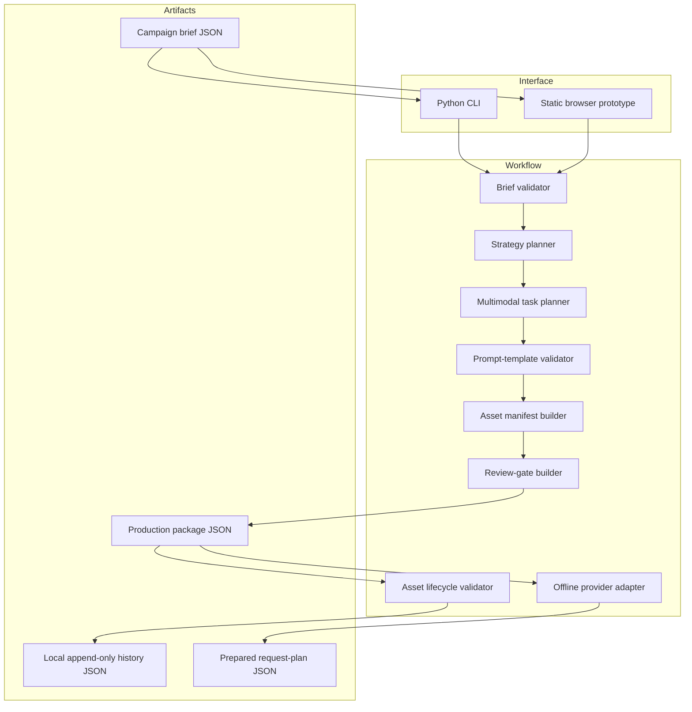
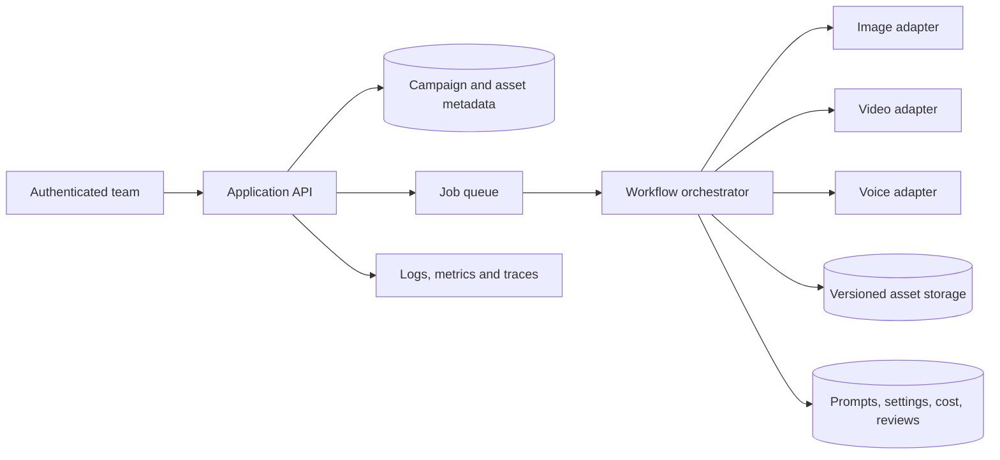

# System Architecture

## v0.3 design goals

- one traceable brief-to-package workflow;
- no paid runtime dependency;
- provider-neutral planning artifacts;
- explicit facts, constraints, ownership and approval;
- honest separation between planning and media generation.

## Logical architecture

The browser mirrors the product flow for a zero-setup demonstration. The Python package is the reference implementation covered by automated tests.

## Component responsibilities

| Component | Responsibility |
| --- | --- |
| `brief.py` | Parse and validate the campaign brief and deliverable specifications. |
| `workflow.py` | Orchestrate strategy, multimodal tasks, manifest and review gates. |
| `cli.py` | Provide local JSON input/output. |
| `lifecycle.py` | Validate asset transitions and preserve stable local event history. |
| `asset_cli.py` | Initialize a ledger and record one explicit transition at a time. |
| `templates.py` | Validate allowlisted placeholders and render configurable task prompts. |
| `providers.py` | Define the adapter interface, validate provider capabilities and build non-sending request envelopes. |
| `provider_cli.py` | Convert a production package into an offline provider request plan. |
| `data/` | Store the synthetic public brief. |
| `examples/` | Preserve a reproducible public package and asset-history example. |
| `site/` | Demonstrate the workflow without external services. |

## Future production architecture

Production decisions still required include authentication, roles, tenant isolation, secret storage, idempotency, queue and retry behavior, concurrency, provider quotas, cost ceilings, asset encryption, content moderation, audit logs, retention and incident response.

## Execution boundary

The workflow owns facts, strategy, tasks and review gates. Template rendering is deterministic and happens inside that workflow. Provider preparation happens afterward through a separate adapter interface. The public adapter has no network method, rejects profiles that enable execution, and emits `prepared_not_sent` request envelopes only.
