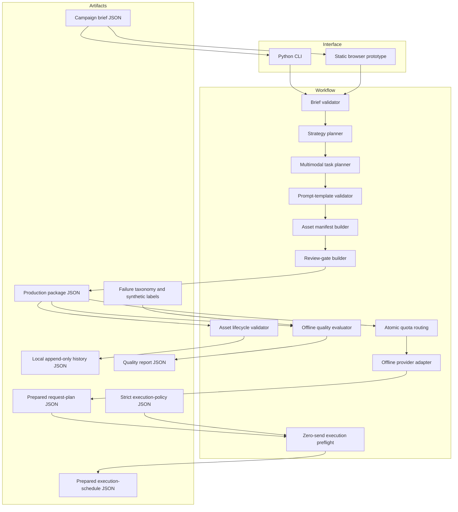
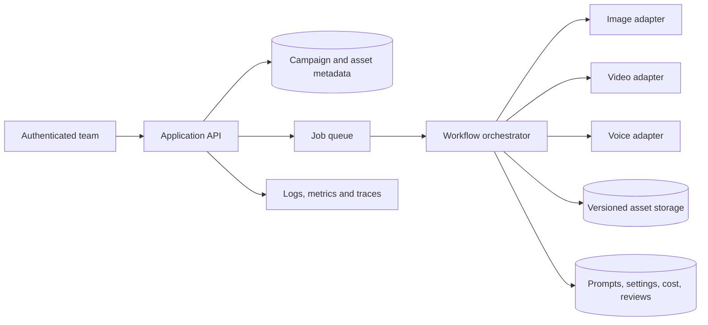

# System Architecture

## v1.1 design goals

- one traceable brief-to-package workflow;
- no paid runtime dependency;
- provider-neutral planning artifacts;
- explicit facts, constraints, ownership and approval;
- honest separation between planning and media generation.

## Logical architecture

The browser mirrors the product flow for a zero-setup demonstration. The Python package is the reference implementation covered by automated tests.

## Component responsibilities

| Component | Responsibility |
| --- | --- |
| `brief.py` | Parse and validate the campaign brief and deliverable specifications. |
| `workflow.py` | Orchestrate strategy, multimodal tasks, manifest and review gates. |
| `cli.py` | Provide local JSON input/output. |
| `lifecycle.py` | Validate asset transitions and preserve stable local event history. |
| `asset_cli.py` | Initialize a ledger and record one explicit transition at a time. |
| `templates.py` | Validate allowlisted placeholders and render configurable task prompts. |
| `providers.py` | Define the adapter interface, validate provider capabilities and build non-sending request envelopes. |
| `provider_cli.py` | Convert a production package into an offline provider request plan. |
| `routing.py` / `routing_cli.py` | Enforce abstract-unit/request ceilings atomically before preparing provider envelopes. |
| `execution_preflight.py` | Validate only eligible zero-send envelopes, reject duplicates before job creation, and derive deterministic idempotency/job identifiers and bounded waves. |
| `execution_preflight_cli.py` | Write the review-only execution schedule; it has no queue, worker, retry or network method. |
| `quality.py` | Validate failure labels, bind cases to package assets and make release-blocking decisions. |
| `quality_cli.py` | Produce an offline JSON quality-fixture report. |
| `data/` | Store the synthetic brief, policies, failure taxonomy and manually labelled review fixture. |
| `examples/` | Preserve reproducible package, history, provider-request, execution-preflight and quality-report examples. |
| `site/` | Demonstrate the workflow without external services. |

## Future production architecture

Production decisions still required include authentication, roles, tenant isolation, secret storage, provider-enforced idempotency, durable queue/worker and retry behavior, live concurrency, provider quotas, cost ceilings, asset encryption, content moderation, audit logs, retention and incident response.

## Execution boundary

The workflow owns facts, strategy, tasks and review gates. Template rendering is deterministic and happens inside that workflow. Provider preparation happens afterward through a separate adapter interface. The public adapter has no network method, rejects profiles that enable execution, and emits `prepared_not_sent` request envelopes only. The execution preflight can turn a valid envelope set into deterministic job descriptors and concurrency waves, but `execution_authorized` remains false and every attempt/request/send counter remains zero. Duplicate fingerprints or IDs return no jobs or waves. These local hashes do not prove a provider will enforce idempotency. The quality evaluator reads structured synthetic labels; it has no image, video or audio analysis implementation and cannot approve real media.
