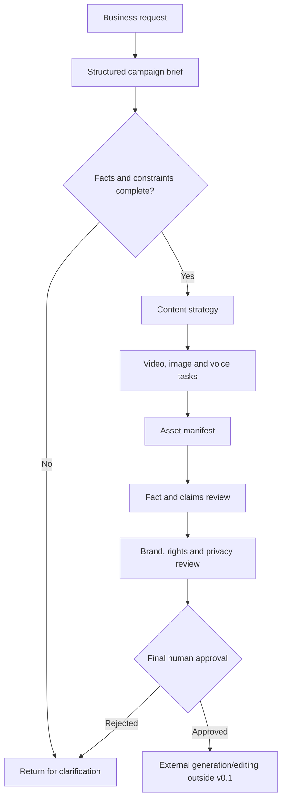

# Business Workflow

## Current controlled flow

## Role boundaries

| Role | Responsibility |
| --- | --- |
| Business/Product Owner | Approves product facts, prohibited claims and CTA. |
| Content Operations | Owns brief quality, brand direction and production coordination. |
| AIGC Operator | Executes approved tasks in selected tools and records settings/results in a future version. |
| Reviewer | Checks product identity, rights, privacy, platform rules and final asset. |
| Authorized Publisher | Makes the final external publishing decision. |

The workflow never treats generation output as automatically approved. Rejected assets return to the task or brief that caused the problem.
