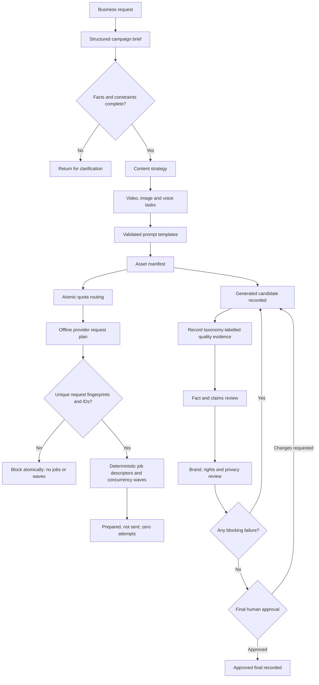

# Business Workflow

## Current controlled flow

## Role boundaries

| Role | Responsibility |
| --- | --- |
| Business/Product Owner | Approves product facts, prohibited claims and CTA. |
| Content Operations | Owns brief quality, brand direction and production coordination. |
| AIGC Operator | Executes approved tasks in selected tools and records settings/results in a future version. |
| Reviewer | Checks product identity, rights, privacy, platform rules and final asset. |
| Authorized Publisher | Makes the final external publishing decision. |

The workflow never treats generation output as automatically approved. Rejected assets return to the task or brief that caused the problem.

The current workflow validates prompt templates and provider capabilities before producing request envelopes. Those envelopes are planning artifacts only. The v1.1 execution preflight accepts only an eligible zero-call plan, derives deterministic fingerprints/idempotency keys/job IDs and arranges descriptors into bounded waves. Duplicate fingerprints or request IDs block before descriptors are created. No live queue, worker, timer, retry or provider send exists. Its checked-in quality cases are synthetic review records used to validate taxonomy behavior, not generated candidates. The local ledger records each status change as a new event, but it does not authenticate the named actor; production approval still requires an authorized system and organizational control.
